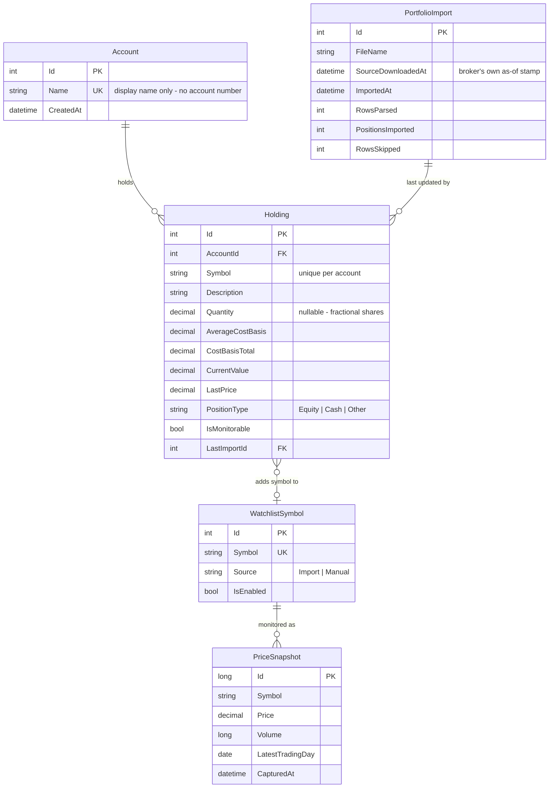

# portfolioapp

Azure Functions app (.NET 8, isolated worker) for the portfolio monitor. It runs a
timer-triggered monitoring pass **during market hours** and fetches the latest quote for each
configured ticker (`MSFT` and `NVDA` by default) from the
[Alpha Vantage](https://www.alphavantage.co/documentation/) `GLOBAL_QUOTE` endpoint.

This is the data-acquisition stage of the flow in [`../DESIGN.md`](../DESIGN.md). Persisting
snapshots, evaluating rules, and sending alerts are the follow-up stages.

## Layout

| Path | Purpose |
| --- | --- |
| `Functions/QuoteMonitorFunction.cs` | Timer trigger that drives one monitoring run |
| `Services/UsEquityMarketCalendar.cs` | Session/holiday/early-close calendar |
| `Services/FidelityPositionsCsvParser.cs` | Reads broker positions exports |
| `Services/PortfolioImportService.cs` | Upserts accounts, holdings, and watchlist entries |
| `Services/WatchlistProvider.cs` | Resolves monitored symbols from the DB |
| `Functions/PortfolioUploadFunction.cs` | `POST /api/portfolio/import` |
| `Functions/HealthCheckFunction.cs` | `GET /api/health` readiness probe |
| `Data/Scripts/migrate.sql` | Idempotent migration script for deployments |
| `Configuration/MarketHoursOptions.cs` | Trading-session settings |
| `Services/AlphaVantageClient.cs` | Typed `HttpClient` for `GLOBAL_QUOTE`, plus response mapping |
| `Services/AlphaVantageException.cs` | Provider-level failure, distinguishes throttling from other errors |
| `Models/StockQuote.cs` | Normalized quote used by the rest of the app |
| `Models/GlobalQuoteResponse.cs` | Raw Alpha Vantage payload |
| `Configuration/AlphaVantageOptions.cs` | Validated settings bound from the `AlphaVantage` section |
| `Data/PortfolioDbContext.cs` | EF Core context and `PriceSnapshots` mapping |
| `Data/Migrations/` | EF Core migrations |
| `Models/PriceSnapshot.cs` | Persisted snapshot entity |
| `Services/SqlQuoteStore.cs` | Writes snapshots, skipping unchanged quotes |
| `Program.cs` | DI wiring, OpenTelemetry setup, and API-key log redaction |

## Scheduling and market hours

Two independent controls decide whether a run happens:

1. **`QuoteMonitorSchedule`** — an NCRONTAB expression (`second minute hour day month day-of-week`)
   read from application settings, so the cadence changes without a rebuild. This is a coarse
   filter evaluated in the host's time zone (UTC by default).
2. **`IMarketCalendar`** — the precise check. The cron can't express a 09:30 open, exchange
   holidays, or half-day closes, so the function re-checks the session in exchange-local time
   and returns early when the market is shut. This happens *before* any HTTP call, so a closed
   tick costs no API quota.

The default `0 */15 13-21 * * 1-5` covers 09:30–16:00 ET across both EDT (13:30–20:00 UTC) and
EST (14:30–21:00 UTC), and the calendar trims the edges.

### Picking an interval: match your data tier

Polling faster than the data refreshes just returns the same quote repeatedly. Alpha Vantage's
[free tier is 25 requests/day and does **not** include realtime or 15-minute delayed US
data](https://www.alphavantage.co/support/#api-key) — `GLOBAL_QUOTE` returns end-of-day values,
which change only once per trading day. Realtime and 15-minute delayed feeds are
[premium](https://www.alphavantage.co/premium/) (from $49.99/month, 75 requests/min, no daily cap)
and need a separate data entitlement.

| Tier | How often data changes | Suggested `QuoteMonitorSchedule` | `MarketHours__Enabled` | Calls/day (2 symbols) |
| --- | --- | --- | --- | --- |
| Free (EOD) | Once per day | `0 30 21 * * 1-5` (once, after close) | `false` | 2 |
| Premium, 15-min delayed | Every 15 min | `0 */15 13-21 * * 1-5` | `true` | 52 |
| Premium, realtime | Continuous | `0 */5 13-21 * * 1-5` | `true` | 156 |

On the free tier the market-hours guard must be **disabled**, because the only useful poll is
after the close — that is the one moment the daily value is final.

For reference, the previous `0 */5 * * * *` (every 5 minutes, around the clock) was 576
calls/day: 23x the free-tier allowance, and all but one per day returned identical data.

### Holidays need annual maintenance

`MarketHours__Holidays` and `MarketHours__EarlyCloses` are configuration, not code, because
exchange holidays move each year. Defaults cover **2026–2027**; extend them before January 2028
or the app will poll on closed days (wasting quota, though the dedup check still prevents
duplicate rows).

## Storage

The schema follows the entities in `DESIGN.md`.



### Why these four tables

- **`Account`** — identified by *name only*. The broker's account number is never read from the
  file, so it cannot reach the database, logs, or telemetry.
- **`PortfolioImport`** — an audit row per upload. It captures the broker's own "Date downloaded"
  stamp, which can be materially older than the upload time, so a stale file is detectable.
- **`Holding`** — current positions, unique on `(AccountId, Symbol)`. Re-uploading updates rows
  in place rather than appending, so the table always mirrors the latest export.
- **`WatchlistSymbol`** — the monitored universe, kept separate from `Holding` so a symbol can be
  watched without being owned, and so selling out of a position doesn't silently stop monitoring
  it. `IsEnabled` suspends a symbol without losing its history.

`PriceSnapshot` joins to these on `Symbol`, so allocation and drift are a single query against
holdings plus the latest snapshot per symbol.

### Uploading a positions file

```http
POST /api/portfolio/import
```

Accepts a CSV as multipart form-data (`file`) or as the raw request body with `?fileName=`.
Returns the import id and counts:

```json
{ "importId": 1, "positionsImported": 2, "cashRowsSkipped": 1, "symbolsAddedToWatchlist": 2 }
```

Once anything is imported, the monitoring run reads its symbols from `WatchlistSymbol` and the
`AlphaVantage__Symbols` setting becomes a fallback used only while the watchlist is empty.

### What the parser has to survive

Broker exports are display files, not data feeds. `FidelityPositionsCsvParser` handles:

| In the file | Handling |
| --- | --- |
| `Account number` column | **Never read** — the column is skipped entirely |
| `($0.09)`, `($39,573.87)` | Accounting negatives → `-0.09`, `-39573.87` |
| `"$3,567.50 "` | Quoted, `$`-prefixed, thousands separators, trailing space |
| `FCASH**`, `SPAXX**` | Stored as `PositionType.Cash`, **excluded** from quote lookups |
| `Pending Activity` | Classified as non-monitorable |
| `550.541` | Fractional share quantities |
| Blank rows, legal disclaimers | Skipped and counted |
| `Date downloaded Sep-09-2026 11:41 p.m ET` | Parsed to an instant with the correct ET offset |

Excluding cash rows matters for cost as well as correctness: sending `FCASH**` to the quote API
would burn a request from a small daily budget and return an error every time.

### Why Azure SQL

Each run persists its quotes as `PriceSnapshot` rows. SQL was chosen over Table Storage because the roadmap is dominated by relational
and analytical work — moving averages and RSI over a time window, allocation percentages across
holdings, and signal deduplication — which map to window functions, joins, and filtered unique
indexes. At roughly 150 rows/day the dataset is far too small for Table Storage's scale
advantage to offset that.

Writes go through `IQuoteStore`, so the backing store can be swapped without touching the
monitoring function.

### Unchanged quotes are not re-stored

Alpha Vantage's free tier serves delayed (often end-of-day) data, so polling every five minutes
returns the *identical* quote repeatedly. `SqlQuoteStore` compares each quote against the last
stored snapshot for that symbol and skips the write when price, volume, and trading day all
match. Without this, a single trading day would accumulate ~288 identical rows per symbol and a
20-period moving average would average 20 copies of the same price.

### Database setup

```powershell
cd portfolioapp
$env:ConnectionStrings__PortfolioDb = "Server=(localdb)\MSSQLLocalDB;Database=portfoliomonitor;Trusted_Connection=True;TrustServerCertificate=True"
dotnet ef database update
```

Migrations are applied explicitly, never automatically at startup. To add one after changing the
model:

```powershell
dotnet ef migrations add <Name> --output-dir Data\Migrations
```

## Observability

Telemetry uses **OpenTelemetry**, not the Application Insights SDK.

- `host.json` sets `"telemetryMode": "OpenTelemetry"`, which opts the Functions **host** in.
- `Program.cs` calls `AddOpenTelemetry().UseFunctionsWorkerDefaults().UseOtlpExporter()`, which
  opts the **worker** process in and exports logs, traces, and metrics over OTLP.

Both processes read the standard `OTEL_EXPORTER_OTLP_*` environment variables, so the app can
export to any OTLP-compliant backend (Grafana/Tempo/Loki, Datadog, New Relic, Honeycomb, an
OpenTelemetry Collector, and so on).

To send data to Application Insights *through* OpenTelemetry instead, set
`APPLICATIONINSIGHTS_CONNECTION_STRING` and swap `UseOtlpExporter()` for
`UseAzureMonitorExporter()` from the `Azure.Monitor.OpenTelemetry.Exporter` package.

> Because worker logs now flow through the OpenTelemetry pipeline, they no longer appear in the
> `func start` console. Point the app at a collector to see them.

## Prerequisites

- [.NET 8 SDK](https://dotnet.microsoft.com/download)
- [Azure Functions Core Tools v4](https://learn.microsoft.com/azure/azure-functions/functions-run-local)
- [Azurite](https://learn.microsoft.com/azure/storage/common/storage-use-azurite) — the timer
  trigger needs `AzureWebJobsStorage` for its schedule state and singleton lock
- A SQL Server instance for the snapshot store. LocalDB (bundled with Visual Studio) works for
  local development; use Azure SQL in production.
- A free [Alpha Vantage API key](https://www.alphavantage.co/support/#api-key)
- An OTLP endpoint to receive telemetry (an OpenTelemetry Collector, or any OTLP-compatible
  vendor backend). Optional for local runs — export simply fails quietly if nothing listens.

## Configuration

Settings bind to the `AlphaVantage` configuration section. Use the double-underscore form in
`local.settings.json` and in Azure application settings.

| Setting | Default | Notes |
| --- | --- | --- |
| `AlphaVantage__ApiKey` | _(required)_ | Host fails to start when this is empty |
| `AlphaVantage__Symbols` | `MSFT,NVDA` | Comma-separated; trimmed, upper-cased, de-duplicated |
| `AlphaVantage__BaseUrl` | `https://www.alphavantage.co/` | Override for testing |
| `AlphaVantage__RequestTimeoutSeconds` | `30` | Per-request HTTP timeout |
| `AlphaVantage__DelayBetweenRequestsMilliseconds` | `1000` | Spacing between symbols to avoid burst throttling |

Scheduling and trading-session settings:

| Setting | Default | Notes |
| --- | --- | --- |
| `QuoteMonitorSchedule` | `0 */15 13-21 * * 1-5` | **Required.** NCRONTAB; the function fails to load if unset |
| `MarketHours__Enabled` | `true` | Set `false` to run on every tick (free tier / testing) |
| `MarketHours__TimeZone` | `America/New_York` | IANA or Windows id; DST handled automatically |
| `MarketHours__Open` | `09:30` | Exchange-local, inclusive |
| `MarketHours__Close` | `16:00` | Exchange-local, exclusive |
| `MarketHours__Holidays` | 2026–2027 NYSE dates | Comma-separated `yyyy-MM-dd` |
| `MarketHours__EarlyCloses` | 2026–2027 half-days | Comma-separated `yyyy-MM-dd=HH:mm` |

The snapshot store connection string is read from `ConnectionStrings:PortfolioDb`
(`ConnectionStrings__PortfolioDb` as an environment variable / Azure application setting). The
host fails to start when it is missing — silently discarding fetched quotes is exactly the
failure this store exists to prevent.

`local.settings.json` is git-ignored so the key stays out of source control.
`local.settings.sample.json` shows the expected shape.

Telemetry settings (read by both the host and the worker):

| Setting | Example | Notes |
| --- | --- | --- |
| `OTEL_EXPORTER_OTLP_ENDPOINT` | `http://localhost:4318` | Your collector or vendor endpoint |
| `OTEL_EXPORTER_OTLP_PROTOCOL` | `http/protobuf` | Or `grpc` (default endpoint port `4317`) |
| `OTEL_EXPORTER_OTLP_HEADERS` | `api-key=...` | Vendor auth headers, when required |
| `OTEL_SERVICE_NAME` | `portfolioapp` | Sets `service.name`; set it locally to match production |

> The bundled `demo` key only serves a small whitelist of tickers (`MSFT` works, `NVDA` does
> not) and returns a throttling notice for everything else. Replace it with your own key.

## Run locally

```powershell
# terminal 1 - storage emulator
azurite --silent --location $env:TEMP\azurite-portfolioapp

# terminal 2 - an OTLP collector on :4318 (optional, to see telemetry)

# terminal 3 - functions host
cd portfolioapp
func start
```

The timer fires on the next 5-minute boundary. To run a pass immediately without waiting:

```powershell
Invoke-RestMethod -Method Post `
  -Uri 'http://localhost:7071/admin/functions/QuoteMonitorFunction' `
  -ContentType 'application/json' -Body '{"input":""}'
```

Expected output (worker logs go to your OTLP backend; the console shows host-level lines):

```text
The next 5 occurrences of the 'QuoteMonitorFunction' schedule
(Cron: '0 0,5,10,15,20,25,30,35,40,45,50,55 * * * *') will be:
10/04/2026 10:55:00-07:00
10/04/2026 11:00:00-07:00
...
Executing 'Functions.QuoteMonitorFunction' (Reason='Timer fired at ...')
Executed 'Functions.QuoteMonitorFunction' (Succeeded, Duration=1626ms)
```

## Tests

```powershell
dotnet test portfolioapp.Tests
```

## Behaviour notes

- **Schedule** — set by `QuoteMonitorSchedule`; see
  [Scheduling and market hours](#scheduling-and-market-hours).
- **Closed-market ticks are free** — the session check runs before any HTTP call, so a tick
  outside the session costs no API quota (observed: ~6 ms versus ~270 ms for a real run).
- **Retries are failure-aware** — the run retries with exponential backoff, but only bubbles up
  when at least one failure was *retryable*. A run that failed purely on rate limits is logged as
  an error and left alone, because retrying cannot succeed and would spend more of the budget.
- **Partial failures** — one bad symbol is logged and skipped so the rest of the run continues.
  If *every* symbol fails, the function throws so the failure shows up in host metrics and
  exported telemetry rather than passing silently.
- **Write failures fail the run** — quotes are persisted before the run reports success, so a
  storage outage surfaces as a failed execution instead of silent data loss.
- **Throttling** — Alpha Vantage answers with HTTP 200 and an `Information` or `Note` field
  when a limit is hit, so the client inspects the body rather than the status code. These are
  logged as warnings, not errors.
- **API key redaction** — Alpha Vantage only accepts the key as a query-string parameter, and
  the default `HttpClient` logging writes the full request URI. `Program.cs` raises those two
  logging categories to `Warning` so the key is never written to logs or exported telemetry.
- **Rate limits** — the free tier allows 25 requests/day. Match the interval to your tier using
  the table above, or the run will exhaust the daily budget before the session ends.
- **Delayed data** — free-tier quotes are end-of-day, so `LatestTradingDay` is carried on every
  quote and must be shown wherever a price is displayed.

## Deploy

### Pre-deployment checklist

| # | Item | Why it blocks |
| --- | --- | --- |
| 1 | Apply `Data/Scripts/migrate.sql` to the target database | Migrations are **not** applied at startup; without this every write fails |
| 2 | Set `QuoteMonitorSchedule` | **Hard failure** — a `%setting%` binding has no default, so the timer function fails to index and the app starts with no functions |
| 3 | Set `ConnectionStrings__PortfolioDb` | Host throws at startup by design |
| 4 | Set `AlphaVantage__ApiKey` to a real key | `demo` serves only a whitelist; options validation rejects an empty key |
| 5 | Match the schedule to your data tier | See [Picking an interval](#picking-an-interval-match-your-data-tier) — the free tier is 25 requests/day |
| 6 | Point `AzureWebJobsStorage` at a real storage account | The timer stores schedule state and its singleton lock there |
| 7 | Set `APPLICATIONINSIGHTS_CONNECTION_STRING` or `OTEL_EXPORTER_OTLP_ENDPOINT` | Without one, telemetry is emitted nowhere |
| 8 | Configure CORS for the web UI origin | The browser cannot call `POST /api/portfolio/import` otherwise |
| 9 | Verify `GET /api/health` returns 200 | Confirms config, connectivity, and migrations in one call |

```powershell
func azure functionapp publish <function-app-name>
```

### Database migrations

Migrations are applied explicitly, never at startup — startup migration races across instances,
slows cold start, and requires the runtime identity to hold schema-modification rights.

`Data/Scripts/migrate.sql` is generated with `--idempotent`, so it is safe to run against a new
or partially migrated database and safe to re-run:

```powershell
sqlcmd -S <server> -d <database> -i portfolioapp\Data\Scripts\migrate.sql
```

Regenerate it after adding a migration:

```powershell
dotnet ef migrations script --idempotent --output Data\Scripts\migrate.sql
```

### Passwordless SQL (recommended)

Prefer a managed identity over a password in the connection string:

```
Server=tcp:<server>.database.windows.net,1433;Database=<db>;Authentication=Active Directory Default;Encrypt=True;
```

Then grant the function app's identity access:

```sql
CREATE USER [<function-app-name>] FROM EXTERNAL PROVIDER;
ALTER ROLE db_datareader ADD MEMBER [<function-app-name>];
ALTER ROLE db_datawriter ADD MEMBER [<function-app-name>];
```

Keep schema-change rights out of the runtime identity: the migration script should be applied by
a separate deployment principal.

### Health endpoint

`GET /api/health` is anonymous so platform probes can reach it, and reports only whether
dependencies resolve — never connection strings or keys.

```json
{
  "status": "unhealthy",
  "database": { "reachable": true, "pendingMigrations": ["20260910033252_InitialCreate"], "error": null },
  "market": { "guardEnabled": true, "isOpen": false, "reason": "AfterClose", "exchangeLocalTime": "2026-09-10 19:18" },
  "monitoredSymbolCount": null
}
```

Returns `503` when the database is unreachable or migrations are pending, `200` otherwise.

### Still missing before a production deployment

- **No IaC.** There is no Bicep/Terraform for the function app, SQL database, storage account, or
  Key Vault. Everything above is manual today.
- **No CI/CD.** No build/test/publish pipeline, and no automated migration step.
- **Secrets are plain app settings.** `AlphaVantage__ApiKey` and any SQL password should be Key
  Vault references.
- **Single environment.** No staging slot, so there is no warm-up or rollback path.
